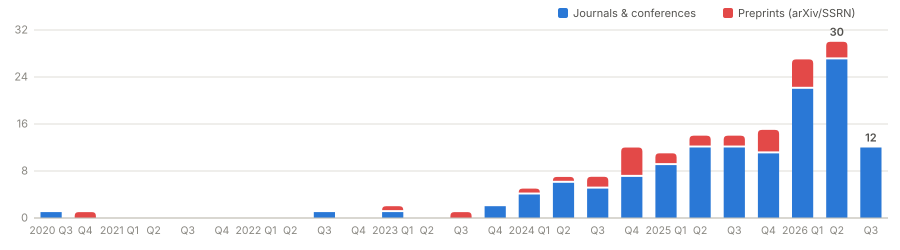
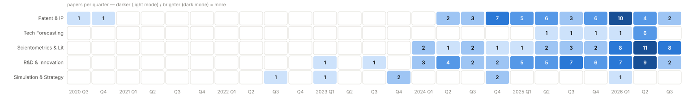

# Awesome LLM Application Papers for Technology & Innovation Management

**Hand-picked research papers applying LLMs, LLM agents, and multi-agent systems (MAS) to technology & innovation management (TIM).**

patent analytics · technology forecasting · scientometrics · R&D & innovation management · market simulation

### Papers over time

<picture>
  <source media="(prefers-color-scheme: dark)" srcset="assets/trend-dark.svg">
  
</picture>

*Core list only. Quarterly counts, dated by first public appearance (arXiv posting or journal online date). Blue = journals & conferences, red = preprints (arXiv/SSRN).*

### Which areas peak when

<picture>
  <source media="(prefers-color-scheme: dark)" srcset="assets/fields-dark.svg">
  
</picture>

*Core papers per research area per quarter — the hot cells show each cluster's peak period.*

<!-- AUTOGEN:VENUES BEGIN (generated from data/papers.tsv) -->

### Where these papers appear

| Venue | Papers |
|---|---:|
| arXiv (preprints) | 27 |
| Scientometrics | 23 |
| World Patent Information | 21 |
| J. Engineering Design | 13 |
| Advanced Engineering Informatics | 9 |
| Information Processing & Management | 9 |
| J. Mechanical Design | 6 |
| Design Science | 4 |
| Quantitative Science Studies | 4 |
| ACL | 3 |
| Technological Forecasting and Social Change | 3 |
| Technovation | 3 |
| CIRP Annals | 2 |
| Creativity and Innovation Management | 2 |
| Engineering Applications of Artificial Intelligence | 2 |
| Expert Systems with Applications | 2 |
| ICML | 2 |
| Information Systems Research | 2 |
| JASIST | 2 |
| Journal of Product Innovation Management | 2 |
| Organization Science | 2 |
| SIGIR | 2 |
| SSRN (working papers) | 2 |
| Others (1 each): AAAI 2026, AgentScen @ IJCAI 2025, EMNLP 2024, ICLR, IEEE Engineering Management Review, J. Data and Information Science, J. Informetrics, Management Science, NAACL, NeurIPS, Research Evaluation, Research Policy, SIGDIAL 2025, Strategy Science | 14 |

<!-- AUTOGEN:VENUES END -->

## Why this list exists

Most agent paper lists collect research *on* agent architectures (memory, planning, coordination). This list collects the complement: research that *uses* agents on real TIM tasks — the papers that end up scattered across *TFSC*, *Scientometrics*, *World Patent Information*, management journals, and application tracks, and therefore rarely appear in ML-centric lists.

**Inclusion criteria — two tiers.** The **core list** collects peer-reviewed papers or public preprints (arXiv/SSRN) where an LLM or LLM-agent system is applied to and evaluated on a TIM task *directly* — patents and IP, technology foresight, innovation and R&D management, and market simulation for management research. A separate **[Adjacent & enabling methods](#adjacent--enabling-methods)** tier collects benchmarks, domain models, surveys, generic-domain analogues (e.g. medical systematic-review screening), and landmark agent frameworks that TIM applications build on; these are excluded from the headline count and charts. Tools without papers, blog posts, and pure architecture papers are out of scope entirely.

Maintained with a human-in-the-loop pipeline: a monthly GitHub Action sweeps OpenAlex and Semantic Scholar for candidates and opens a review issue; humans curate (see [CONTRIBUTING.md](CONTRIBUTING.md)). The list itself lives in `data/papers.tsv`; the contents and papers sections below are generated from it.

<!-- AUTOGEN:PAPERS BEGIN (edit data/papers.tsv, not this section) -->

## Contents

- **Patent & IP Analytics**
  - [Patent Classification & Screening](#patent-classification--screening) (5)
  - [Patent Landscaping & Technology Intelligence](#patent-landscaping--technology-intelligence) (17)
  - [Prior-Art Search & Patent Retrieval](#prior-art-search--patent-retrieval) (5)
  - [Patent Drafting & Claim Generation](#patent-drafting--claim-generation) (11)
  - [Patent Quality, Novelty & Valuation](#patent-quality-novelty--valuation) (9)
  - [Trademark & Non-Patent IP](#trademark--non-patent-ip) (2)
- [Technology Forecasting & Foresight](#technology-forecasting--foresight) (10)
- **Scientometrics & Literature Analysis**
  - [Literature Screening & Systematic Reviews](#literature-screening--systematic-reviews) (2)
  - [Novelty & Impact Prediction of Research](#novelty--impact-prediction-of-research) (8)
  - [Scientometrics & Science of Science](#scientometrics--science-of-science) (18)
  - [LLM-Assisted Peer Review](#llm-assisted-peer-review) (8)
  - [Research & R&D Evaluation](#research--rd-evaluation) (5)
- **R&D & Innovation Management**
  - [Idea Generation & Creativity in Innovation](#idea-generation--creativity-in-innovation) (18)
  - [New Product Development & R&D Management](#new-product-development--rd-management) (7)
  - [Engineering & Conceptual Design](#engineering--conceptual-design) (29)
- **Simulation, Strategy & Discovery**
  - [Market & Consumer Simulation](#market--consumer-simulation) (6)
  - [Strategy & Decision-Making](#strategy--decision-making) (1)
- [Adjacent & enabling methods](#adjacent--enabling-methods) (56)
- [Related lists](#related-lists)

## Papers

161 core papers. `MAS` badge marks explicitly multi-agent systems. Newest first within each section.

### Patent & IP Analytics

<h4>Patent Classification & Screening</h4>

*Assigning patents to taxonomies (CPC/IPC or custom schemes) and screening for relevance.*

| Paper | Link |
|---|---|
| **[Large Language Models for Patent Classification: Strengths, Trade-offs, and the Long Tail Effect](https://arxiv.org/abs/2601.23200)** — Emer et al., 2026, *arXiv:2601.23200*. Compares LLMs vs BERT on CPC; LLMs win on rare subclasses |  |
| **[Patent Figure Classification using Large Vision-language Models](https://arxiv.org/abs/2501.12751)** — Awale et al., 2025, *arXiv:2501.12751*. LVLMs classify patent figures; PatFigVQA/PatFigCLS datasets |  |
| **[Do large language models understand patents? Enhancing patent classification through AI-generated summaries](https://doi.org/10.1016/j.wpi.2025.102353)** — Yoshikawa et al., 2025, *World Patent Information*. AI-generated summaries boost LLM patent classification accuracy |  |
| **[Improved multi-label hierarchical patent classification using LLMs](https://doi.org/10.1016/j.wpi.2025.102356)** — Rafieian & Vázquez, 2025, *World Patent Information*. LLMs improve hierarchical multi-label patent classification |  |
| **[Scalable multi-label patent classification via iterative large language model-assisted active learning](https://doi.org/10.1016/j.wpi.2025.102380)** — Xiong et al., 2025, *World Patent Information*. Iterative LLM-assisted active learning scales multi-label patent classification |  |

<h4>Patent Landscaping & Technology Intelligence</h4>

*Mapping technology domains from patent corpora; competitive and R&D intelligence.*

| Paper | Link |
|---|---|
| **[Evaluating the value of LLMs in patent-based technology intelligence: Toward increasing efficiency and reducing expert dependency](https://doi.org/10.1016/j.techfore.2025.124375)** — Park et al., 2026, *Technological Forecasting and Social Change*. Evaluates LLMs replacing expert judgment in patent-based technology intelligence |  |
| **[Patent technology knowledge recommendation by integrating large language models and knowledge graphs](https://doi.org/10.1016/j.engappai.2026.114176)** — Yang et al., 2026, *Engineering Applications of Artificial Intelligence*. Couples LLMs with patent knowledge graphs for technology recommendation |  |
| **[A multimodal framework for patent survival and commercialization prediction](https://doi.org/10.1016/j.ipm.2026.104626)** — Sun et al., 2026, *Information Processing & Management*. Multimodal model predicts patent survival and commercialization outcomes |  |
| **[Pioneering exploration in patent landscape studies: leveraging large language models and in-context learning for deeper insights](https://doi.org/10.1007/s11192-026-05537-w)** — Yang et al., 2026, *Scientometrics*. In-context learning deepens LLM patent landscape analysis |  |
| **[RoCoMAP: A Role-Based Collaborative Multi-Agent Framework for Patent Supply–Demand Matching](https://doi.org/10.1007/s11192-026-05777-w)** — He et al., 2026, *Scientometrics*.  Role-based multi-agent framework matches patent supply with demand |  |
| **[Towards efficient patent analysis: A large language model and BERT-refined methodology for keyphrase extraction](https://doi.org/10.1016/j.wpi.2026.102435)** — Mu et al., 2026, *World Patent Information*. LLM and BERT-refined keyphrase extraction for efficient patent analysis |  |
| **[Global innovation landscape of Ganoderma mushrooms: Integrating patent mapping, technological life cycle modeling, and an LLM keyword extraction](https://doi.org/10.1016/j.wpi.2026.102458)** — Foffano et al., 2026, *World Patent Information*. Patent mapping, life-cycle modelling, LLM keywords chart Ganoderma innovation |  |
| **[Patent intelligence in the age of AI: Unlocking strategic insights through granular classification](https://doi.org/10.1016/j.wpi.2026.102454)** — Giuntelli et al., 2026, *World Patent Information*. AI granular classification produces analyst-facing patent matrices and trajectories |  |
| **[Agentic cognitive orchestration for cross-lingual patent intelligence: A modular workflow automation approach](https://doi.org/10.1016/j.wpi.2026.102483)** — Wang & Ke, 2026, *World Patent Information*.  Modular agent workflow automates cross-lingual patent intelligence |  |
| **[Generative AI-based intelligent patent summarization for intellectual property knowledge communication and cooperation](https://doi.org/10.1016/j.wpi.2025.102410)** — Trappey et al., 2025, *World Patent Information*. GenAI patent summarization for IP knowledge communication and cooperation |  |
| **[Integrating Generative Artificial Intelligence techniques into technology function matrix analysis](https://doi.org/10.1016/j.wpi.2025.102352)** — Wang et al., 2025, *World Patent Information*. GenAI automates technology-function matrix construction for patent analysis |  |
| **[Generative AI approach for inventive process visualisation – enhancing human-AI hybrid understanding and comparing of patents](https://doi.org/10.1080/09544828.2025.2518657)** — Trappey et al., 2025, *J. Engineering Design*. Extracts and visualises patent inventive processes for hybrid comparison |  |
| **[Meeting companies’ innovative requirements on online technology trading platforms: A novel large language model-based framework](https://doi.org/10.1016/j.ipm.2025.104392)** — Xu et al., 2025, *Information Processing & Management*. LLM framework matches company technology needs on trading platforms |  |
| **[Automotive innovation landscaping using LLM](https://arxiv.org/abs/2409.14436)** — Gorain et al., 2024, *arXiv:2409.14436*. Prompt-based LLM patent landscaping for fuel-cell innovation mapping |  |
| **[Towards Automated Patent Workflows: AI-Orchestrated Multi-Agent Framework for Intellectual Property Management and Analysis](https://arxiv.org/abs/2409.19006)** — Srinivas et al., 2024, *OWA Workshop @ NeurIPS 2024*.  PatExpert meta-agent orchestrates end-to-end patent analysis workflows |  |
| **[EvoPat: A Multi-LLM-based Patents Summarization and Analysis Agent](https://arxiv.org/abs/2412.18100)** — Wang et al., 2024, *arXiv:2412.18100*.  Multi-LLM agent summarizes patents and tracks innovation evolution |  |
| **[Patent litigation mining using a large language model—Taking unmanned aerial vehicle development as the case domain](https://doi.org/10.1016/j.wpi.2024.102332)** — Trappey et al., 2024, *World Patent Information*. LLM mines patent litigation records in UAV technology domain |  |

<h4>Prior-Art Search & Patent Retrieval</h4>

*Finding and matching prior art; patent-specific embeddings and retrieval.*

| Paper | Link |
|---|---|
| **[LLM-powered Real-time Patent Citation Recommendation for Financial Technologies](https://arxiv.org/abs/2601.16775)** — Deng et al., 2026, *arXiv:2601.16775*. Real-time LLM-embedding citation recommendation over growing patent corpus |  |
| **[Enhancing the Patent Matching Capability of Large Language Models via the Memory Graph](https://arxiv.org/abs/2504.14845)** — Xiong et al., 2025, *SIGIR 2025*. MemGraph entity/ontology memory boosts LLM patent matching |  |
| **[Advancing patent law with generative AI: Human-in-the-loop systems for AI-assisted drafting, prior art search, and multimodal IP protection](https://doi.org/10.1016/j.wpi.2025.102341)** — Bui, 2025, *World Patent Information*. Human-in-the-loop generative AI for drafting, prior-art search, multimodal IP |  |
| **[Designing tailored patent search approaches – A case study on nursing care technology](https://doi.org/10.1016/j.wpi.2025.102420)** — Waterstraat & Walter, 2025, *World Patent Information*. Design-theory multi-perspective keyword search for fuzzy technology fields |  |
| **[Large Language Model Informed Patent Image Retrieval](https://arxiv.org/abs/2404.19360)** — Lo et al., 2024, *PatentSemTech @ SIGIR 2024*. LLM-generated captions improve patent drawing retrieval |  |

<h4>Patent Drafting & Claim Generation</h4>

*Generating and refining patent text: claims, abstracts, full specifications.*

| Paper | Link |
|---|---|
| **[Experimenting with a prompt-based AI examiner for inventive step determination: A rule-based framework toward harmonized patent examination](https://doi.org/10.1016/j.wpi.2026.102463)** — Yamazaki, 2026, *World Patent Information*. Prompt-based AI examiner applies rules to inventive-step determination |  |
| **[Can Large Language Models Generate High-quality Patent Claims?](https://arxiv.org/abs/2406.19465)** — Jiang et al., 2025, *Findings of NAACL 2025*. Evaluates claim generation quality from descriptions across LLMs |  |
| **[PAP2PAT: Benchmarking Outline-Guided Long-Text Patent Generation with Patent-Paper Pairs](https://arxiv.org/abs/2410.07009)** — Knappich et al., 2025, *Findings of ACL 2025*. Paper-to-patent drafting via chunk-based outline-guided generation |  |
| **[Large Language Model for Patent Concept Generation](https://arxiv.org/abs/2409.00092)** — Ren et al., 2025, *Advanced Engineering Informatics*. Knowledge fine-tuned PatentGPT for inventive patent concept generation |  |
| **[PatentWriter: A Benchmarking Study for Patent Drafting with LLMs](https://arxiv.org/abs/2507.22387)** — Shomee et al., 2025, *arXiv:2507.22387*. Benchmarks LLM patent abstract drafting from claims |  |
| **[ToC: Tree-of-Claims Search with Multi-Agent Language Models](https://arxiv.org/abs/2511.16972)** — Yu et al., 2025, *AAAI 2026*.  MCTS editor/examiner agents optimize claims for novelty and scope |  |
| **[Evaluating application of large language models to biomedical patent claim generation](https://doi.org/10.1016/j.wpi.2025.102339)** — Chen & Pan, 2025, *World Patent Information*. Evaluates LLM generation of biomedical patent claims |  |
| **[Generating patent claims with semantic novelty](https://doi.org/10.1016/j.wpi.2025.102404)** — Lee, 2025, *World Patent Information*. Generates patent claims optimised for semantic novelty |  |
| **[ClaimBrush: A Novel Framework for Automated Patent Claim Refinement Based on Large Language Models](https://arxiv.org/abs/2410.05575)** — Kawano et al., 2024, *arXiv:2410.05575*. Rewrites claims via fine-tuned LLM with preference optimization |  |
| **[AutoPatent: A Multi-Agent Framework for Automatic Patent Generation](https://arxiv.org/abs/2412.09796)** — Wang et al., 2024, *arXiv:2412.09796*.  Planner/writer/examiner agents draft full patents from drafts |  |
| **[Patent claim generation by fine-tuning OpenAI GPT-2](https://doi.org/10.1016/j.wpi.2020.101983)** — Lee & Hsiang, 2020, *World Patent Information*. Pioneer work: GPT-2 fine-tuned to draft patent claims |  |

<h4>Patent Quality, Novelty & Valuation</h4>

*Assessing novelty, predicting examiner outcomes, automated quality assurance.*

| Paper | Link |
|---|---|
| **[ERA: Aligning semantic models with revealed economic preference for real-time and explainable patent valuation](https://doi.org/10.1016/j.ipm.2026.104898)** — Yoo et al., 2026, *Information Processing & Management*. Aligns patent semantics with revealed economic preference for explainable valuation |  |
| **[Perception to Cognition: Patent Value Assessment Based on Large Language Model Semantic Enhancement and Ensemble Learning](https://doi.org/10.1515/jdis-2025-0455)** — Xi et al., 2026, *J. Data and Information Science*. Virtual-assessor LLM semantics plus ensemble learning identify high-value patents |  |
| **[Structured LLM-based patent comparison across three evaluation dimensions](https://doi.org/10.1016/j.wpi.2026.102430)** — Choi & Park, 2026, *World Patent Information*. Structured LLM comparison of patents across three evaluation dimensions |  |
| **[Towards Automated Quality Assurance of Patent Specifications: A Multi-Dimensional LLM Framework](https://arxiv.org/abs/2510.25402)** — Chai et al., 2025, *arXiv:2510.25402*. Industry LLM framework auto-checking patent specification quality |  |
| **[Can AI Examine Novelty of Patents?: Novelty Evaluation Based on the Correspondence between Patent Claim and Prior Art](https://arxiv.org/abs/2502.06316)** — Ikoma et al., 2025, *arXiv:2502.06316*. LLM novelty assessment aligning claims with prior art |  |
| **[Disentangling patent quality: using a large language model for a systematic literature review](https://doi.org/10.1007/s11192-024-05206-w)** — Schmitt, 2025, *Scientometrics*. LLM-run systematic review builds multidimensional patent quality framework |  |
| **[Assessing the standard-essentiality of 5G technology patents by means of generative artificial intelligence](https://doi.org/10.1016/j.wpi.2025.102363)** — Herzberg, 2025, *World Patent Information*. Generative AI screens declared 5G patents for standard-essentiality |  |
| **[PatentEdits: Framing Patent Novelty as Textual Entailment](https://arxiv.org/abs/2411.13477)** — Lee et al., 2024, *arXiv:2411.13477*. Predicts examiner-driven claim edits as an entailment task |  |
| **[A novel approach to measuring the scope of patent claims based on probabilities obtained from (large) language models](https://doi.org/10.1016/j.wpi.2024.102321)** — Ragot, 2024, *World Patent Information*. Measures patent claim scope from language-model token probabilities |  |

<h4>Trademark & Non-Patent IP</h4>

*IP tasks beyond patents: trademark similarity, opposition, and clearance.*

| Paper | Link |
|---|---|
| **[A large language model-based method for trademark similarity analysis in the Brazilian context](https://doi.org/10.1016/j.wpi.2026.102436)** — Reis et al., 2026, *World Patent Information*. LLM-based trademark similarity assessment for Brazilian filings |  |
| **[Automatic similarity detection for trademark](https://doi.org/10.1016/j.wpi.2026.102452)** — Le Nir et al., 2026, *World Patent Information*. Predicts EUIPO goods/services conflict decisions from 107,570 opposition records |  |

<h3>Technology Forecasting & Foresight</h3>

*Emerging-technology detection, weak signals, opportunity discovery, trend prediction.*

| Paper | Link |
|---|---|
| **[Anticipating Innovation Using Large Language Models](https://arxiv.org/abs/2605.04875)** — Fenoaltea et al., 2026, *arXiv:2605.04875*. LLMs anticipate future innovation and technology emergence |  |
| **[Tuning into whispered frequencies: Harnessing Large Language Models to detect Weak Signals in complex socio-technical systems](https://doi.org/10.1016/j.engappai.2026.114738)** — Lombardi et al., 2026, *Engineering Applications of Artificial Intelligence*. LLM pipeline detects foresight weak signals in socio-technical texts |  |
| **[AI-driven opportunity forecasting for technology startup identification: Integrating graph embedding, LLMs, and informetric analysis](https://doi.org/10.1016/j.techfore.2026.124649)** — Zhai et al., 2026, *Technological Forecasting and Social Change*. Graph embedding plus LLM informetrics forecast startup technology opportunities |  |
| **[ForeSci: Evaluating LLM Agents for Forward-Looking AI Research Judgment](https://arxiv.org/abs/2606.00644)** — Tian et al., 2026, *arXiv:2606.00644*. Benchmark tests agent forecasts of future research directions |  |
| **[MPCoT: explainable identification in technology opportunity analysis via metapaths and multi-perspective chain-of-thought reasoning](https://doi.org/10.1016/j.eswa.2026.133318)** — Li et al., 2026, *Expert Systems with Applications*. Metapaths and multi-perspective chain-of-thought explain technology opportunities |  |
| **[Signals of innovation online: Identifying innovative firms by combining website mining and evidence producing LLMs](https://doi.org/10.1016/j.techfore.2026.124695)** — Grybauskas et al., 2026, *Technological Forecasting and Social Change*. Website mining plus evidence-producing LLMs identify innovative firms |  |
| **[Prescriptive technology intelligence for technology opportunity discovery: An LLM-based automated framework for narrating promising technology concepts](https://doi.org/10.1016/j.technovation.2026.103584)** — Yoo et al., 2026, *Technovation*. LLM framework narrates promising technology concepts for opportunity discovery |  |
| **[DiTTO-LLM: Framework for Discovering Topic-based Technology Opportunities via Large Language Model](https://arxiv.org/abs/2509.09724)** — Kim et al., 2025, *arXiv:2509.09724*. LLM tracks patent topic evolution to discover technology opportunities |  |
| **[Predicting New Research Directions in Materials Science using Large Language Models and Concept Graphs](https://arxiv.org/abs/2506.16824)** — Marwitz et al., 2025, *arXiv:2506.16824*. LLM concept extraction plus graph model predicts unexplored combinations |  |
| **[Technology opportunity analysis for creating innovative solutions: A framework for cross-field insights using patent data](https://doi.org/10.1016/j.aei.2025.104116)** — Kim et al., 2025, *Advanced Engineering Informatics*. Cross-field patent framework surfaces technology opportunities for solutions |  |

### Scientometrics & Literature Analysis

<h4>Literature Screening & Systematic Reviews</h4>

*LLMs as screeners in systematic reviews — structurally the same include/exclude task as valid-patent selection.*

| Paper | Link |
|---|---|
| **[Scientific hypothesis prediction based on large language models and causal graphs](https://doi.org/10.1016/j.ipm.2026.104894)** — Ba et al., 2026, *Information Processing & Management*. Predicts scientific hypotheses from LLMs and causal graphs |  |
| **[SocLitGen: An LLM-assisted framework for automated literature review in social sciences](https://doi.org/10.1016/j.ipm.2026.104885)** — Hu et al., 2026, *Information Processing & Management*. LLM-assisted framework automates social-science literature reviews |  |

<h4>Novelty & Impact Prediction of Research</h4>

*Scoring the novelty of papers and predicting their scientific impact.*

| Paper | Link |
|---|---|
| **[Are Large Language Models able to Predict Highly Cited Papers? Evidence from Statistical Publications](https://arxiv.org/abs/2601.13627)** — Ye et al., 2026, *arXiv:2601.13627*. Tests LLM citation-impact prediction on statistics publications |  |
| **[Can small and reasoning large language models score journal articles for research quality and do averaging and few-shot help?](https://doi.org/10.1007/s11192-026-05585-2)** — Thelwall & Mohammadi, 2026, *Scientometrics*. Small/reasoning LLMs score research quality; averaging across queries helps |  |
| **[Automated Novelty Evaluation of Academic Paper: A Collaborative Approach Integrating Human and Large Language Model Knowledge](https://doi.org/10.1002/asi.70005)** — Wu et al., 2025, *JASIST*. Human-LLM knowledge fusion predicts method novelty of papers |  |
| **[Evaluating the predictive capacity of ChatGPT for academic peer review outcomes across multiple platforms](https://doi.org/10.1007/s11192-025-05287-1)** — Thelwall & Yaghi, 2025, *Scientometrics*. ChatGPT predicts peer-review outcomes across three publishing platforms |  |
| **[Evaluating and Enhancing Large Language Models for Novelty Assessment in Scholarly Publications](https://arxiv.org/abs/2409.16605)** — Lin et al., 2024, *AISD @ ACL 2025*. SchNovel benchmark and RAG-Novelty for scholarly novelty assessment |  |
| **[From Words to Worth: Newborn Article Impact Prediction with LLM](https://arxiv.org/abs/2408.03934)** — Zhao et al., 2024, *arXiv:2408.03934*. Fine-tuned LLM predicts article impact from title and abstract |  |
| **[Can ChatGPT be used to predict citation counts, readership, and social media interaction? An exploration among 2222 scientific abstracts](https://doi.org/10.1007/s11192-024-04939-y)** — de Winter, 2024, *Scientometrics*. ChatGPT predicts citations, readership, altmetrics across 2,222 abstracts |  |
| **[The use of ChatGPT for identifying disruptive papers in science: a first exploration](https://doi.org/10.1007/s11192-024-05176-z)** — Bornmann et al., 2024, *Scientometrics*. ChatGPT identifies disruptive papers without publication or citation counts |  |

<h4>Scientometrics & Science of Science</h4>

*Agentic and LLM-based tools for bibliometric and science-of-science analysis.*

| Paper | Link |
|---|---|
| **[Large language models for scientometric mapping of scientific controversy: A validated hybrid AI–Human framework](https://doi.org/10.1007/s11192-026-05681-3)** — Susnjak et al., 2026, *Scientometrics*. Validated hybrid LLM-human framework maps scientific controversy stances |  |
| **[Knowledge graphs and large language models for prompt-based scientometric inquiry](https://doi.org/10.1016/j.ipm.2026.104882)** — Correia et al., 2026, *Information Processing & Management*. Knowledge graphs plus LLMs answer scientometric questions from prompts |  |
| **[An embedding-based approach for measuring science–technology topic linkages using LLMs](https://doi.org/10.1016/j.ipm.2026.104983)** — Hu et al., 2026, *Information Processing & Management*. LLM embeddings measure topic linkage between science and technology |  |
| **[Turning Citation Networks Inside Out: Studying Science Using Content-Based Knowledge Graphs from LLM-Derived Taxonomies](https://doi.org/10.1162/qss.a.506)** — Kim et al., 2026, *Quantitative Science Studies*. LLM-induced taxonomies rebuild field structure from content, not citations |  |
| **[Assessing scientific knowledge in patents: A large language model approach](https://doi.org/10.1162/qss.a.493)** — Waterstraat, 2026, *Quantitative Science Studies*. LLM measure of patent science-relatedness beyond nonpatent references |  |
| **[Why grounded large language models fail without domain-specialized retrieval: an experimental scientometric study in solar physics](https://doi.org/10.1007/s11192-026-05784-x)** — Insardi & Gradvohl, 2026, *Scientometrics*. Retrieval infrastructure systematically shapes LLM scientometric outputs |  |
| **[A framework for measuring scientific innovation integrating LLM-driven semantic reasoning and bibliometric analysis](https://doi.org/10.1007/s11192-026-05770-3)** — Shang et al., 2026, *Scientometrics*. Combines LLM semantic reasoning with bibliometrics to measure innovation |  |
| **[Evidence access design for llm-based scientometrics: graph-based evidence augmentation over semantic retrieval](https://doi.org/10.1007/s11192-026-05729-4)** — Lee et al., 2026, *Scientometrics*. Graph-based evidence augmentation beats semantic retrieval for scientometrics |  |
| **[LLMs as complementary tools for innovation surveys research: pattern replication and contextual relevance](https://doi.org/10.1007/s11192-026-05571-8)** — Park & Yang, 2026, *Scientometrics*. LLMs replicate innovation-survey response patterns and add contextual depth |  |
| **[CiteFuncRanker: an LLM-based pairwise ranking framework for multi-functional citation analysis](https://doi.org/10.1007/s11192-026-05764-1)** — Wang et al., 2026, *Scientometrics*. LLM pairwise ranking framework for multi-functional citation analysis |  |
| **[A scalable framework for scholarly similarity and novelty measurement with LLM-derived semantic embeddings](https://doi.org/10.1007/s11192-026-05754-3)** — Wang et al., 2026, *Scientometrics*. LLM embeddings scale scholarly similarity and novelty measurement |  |
| **[Deepening citation understanding in scientific literature via LLM-powered context extraction](https://doi.org/10.1007/s11192-026-05637-7)** — Nguyen et al., 2026, *Scientometrics*. LLM extracts citation context to deepen citation-function understanding |  |
| **[AI-Augmented Bibliometric Framework: A Paradigm Shift with Agentic AI for Dynamic, Snippet-Based Research Analysis](https://arxiv.org/abs/2511.21745)** — Bara et al., 2025, *arXiv:2511.21745*.  Agentic AI replaces static bibliometric keyword analysis |  |
| **[The Empowerment of Science of Science by Large Language Models: New Tools and Methods](https://arxiv.org/abs/2511.15370)** — Liang et al., 2025, *arXiv:2511.15370*. Survey of LLM tools for scientometrics and research front detection |  |
| **[SciSciGPT: Advancing Human-AI Collaboration in the Science of Science](https://arxiv.org/abs/2504.05559)** — Shao et al., 2025, *arXiv:2504.05559*.  Specialist agents automate science-of-science analytics workflows |  |
| **[Scaling research aim identification: Language models for classifying scientific and societal‐oriented studies](https://doi.org/10.1002/asi.70004)** — Wu et al., 2025, *JASIST*. Language models classify basic, applied, and societal research aims |  |
| **[AgentReview: Exploring Peer Review Dynamics with LLM Agents](https://arxiv.org/abs/2406.12708)** — Jin et al., 2024, *EMNLP 2024*.  Reviewer/author/AC agents simulate peer-review dynamics |  |
| **[Large-scale text analysis using generative language models: A case study in discovering public value expressions in AI patents](https://doi.org/10.1162/qss_a_00285)** — Pelaez et al., 2024, *Quantitative Science Studies*. GPT-4 labels public value expressions across 5.4M patent sentences |  |

<h4>LLM-Assisted Peer Review</h4>

*LLMs writing, checking, or auditing manuscript reviews — the review act itself.*

| Paper | Link |
|---|---|
| **[Toward better pragmatic tagging of peer review: Enhancing benchmark datasets via human-in-the-loop multi-agent collaboration](https://doi.org/10.1016/j.ipm.2026.104704)** — He et al., 2026, *Information Processing & Management*.  Human-in-the-loop multi-agent tagging improves peer-review benchmark datasets |  |
| **[Relationship between peer review quality and scientific impact: Insights from LLMs-assessed reviews](https://doi.org/10.1016/j.joi.2026.101801)** — Sun, 2026, *J. Informetrics*. LLM-scored review quality correlates with later citation impact |  |
| **[Can large language models assess the quality of peer review? An empirical study](https://doi.org/10.1007/s11192-026-05622-0)** — Tang et al., 2026, *Scientometrics*. Empirically tests whether LLMs can judge peer-review quality |  |
| **[Impact of large language models on peer review opinions from a fine-grained perspective: evidence from top conference proceedings in AI](https://doi.org/10.1007/s11192-026-05645-7)** — Wu et al., 2026, *Scientometrics*. Fine-grained analysis of LLM influence on conference review opinions |  |
| **[Co-Reviewer: can AI review like a human? An agentic framework for LLM-human alignment in peer review](https://doi.org/10.1007/s11192-026-05557-6)** — Bharti et al., 2026, *Scientometrics*.  Agentic framework aligns LLM reviews with human reviewer judgement |  |
| **[LLM aspect prediction: reviewing academic papers from different aspects with Large Language Model](https://doi.org/10.1007/s11192-026-05771-2)** — Hu et al., 2026, *Scientometrics*. LLM reviews papers along separate evaluative aspects |  |
| **[Fighting Fire with Fire: Infusing Artificial Intelligence into Peer Review to Sustain Quality Scholarship](https://doi.org/10.1287/mnsc.2026.00184)** — Bhargava et al., 2026, *Management Science*. Journals infuse generative AI into review to sustain quality |  |
| **[PaperEval: A universal, quantitative, and explainable paper evaluation method powered by a multi-agent system](https://doi.org/10.1016/j.ipm.2025.104225)** — Huang et al., 2025, *Information Processing & Management*.  Multi-agent system scores papers quantitatively with explanations |  |

<h4>Research & R&D Evaluation</h4>

*LLM scores as institutional evaluation signals: journal quality, research value, funding assessment.*

| Paper | Link |
|---|---|
| **[A global south strategy for evaluating research value with ChatGPT](https://doi.org/10.1162/qss.a.460)** — Nunkoo & Thelwall, 2026, *Quantitative Science Studies*. ChatGPT research-value scoring as peer-review substitute for Global South |  |
| **[Evaluating LLM-assisted research: stage-sensitive asymmetries in productivity and epistemic control](https://doi.org/10.1093/reseval/rvag021)** — Kim & Park, 2026, *Research Evaluation*. Stage-sensitive productivity and epistemic-control asymmetries in LLM-assisted research |  |
| **[Comparing LLM and expert assessments of journal quality](https://doi.org/10.1007/s11192-026-05644-8)** — Saarela et al., 2026, *Scientometrics*. LLM journal-quality ratings compared against Finnish JuFo expert panels |  |
| **[Cicq: a unified framework integrating citation impact and content quality for automated literature evaluation](https://doi.org/10.1007/s11192-026-05594-1)** — Chen et al., 2026, *Scientometrics*. Unifies citation impact with fine-tuned LLM content quality |  |
| **[Research evaluation with ChatGPT: is it age, country, length, or field biased?](https://doi.org/10.1007/s11192-025-05393-0)** — Thelwall & Kurt, 2025, *Scientometrics*. Tests ChatGPT quality scores for age, country, length, field bias |  |

### R&D & Innovation Management

<h4>Idea Generation & Creativity in Innovation</h4>

*LLMs vs humans/crowds in generating product and research ideas.*

| Paper | Link |
|---|---|
| **[Multi-agent AI systems outperform human teams in creativity](https://arxiv.org/abs/2605.17885)** — Hu et al., 2026, *arXiv:2605.17885*.  LLM agent teams beat human teams on judged creativity |  |
| **[Enhancing Research Idea Generation through Combinatorial Innovation and Multi-Agent Iterative Search Strategies](https://doi.org/10.1007/s11192-026-05654-6)** — Chen & Zhang, 2026, *Scientometrics*.  Combinatorial innovation and multi-agent iterative search generate research ideas |  |
| **[Agency Configurations in Generative AI Ideation: How Textual and Visual Idea Concretizations Shape Idea Creativity and Ideator Effort](https://doi.org/10.1287/isre.2024.0952)** — Gordetzki et al., 2026, *Information Systems Research*. Textual versus visual AI concretization shapes idea creativity and effort |  |
| **[The Role of Artificial Intelligence in the Ideation Process](https://doi.org/10.1111/jpim.12791)** — Pescher et al., 2025, *Journal of Product Innovation Management*. AI's role across ideation stages in product innovation |  |
| **[Agent Ideate: Multi-Agent Framework for Product Business Idea Generation from Patents](https://arxiv.org/abs/2507.01717)** — Kanumolu et al., 2025, *AgentScen @ IJCAI 2025*.  Agents mine patents to generate product business ideas |  |
| **[Exploring Design of Multi-Agent LLM Dialogues for Research Ideation](https://arxiv.org/abs/2507.08350)** — Ueda et al., 2025, *SIGDIAL 2025*.  Agent roles, cohort size, depth shape idea novelty |  |
| **[Deep Ideation: Designing LLM Agents to Generate Novel Research Ideas on Scientific Concept Network](https://arxiv.org/abs/2511.02238)** — Zhao et al., 2025, *arXiv:2511.02238*.  Explore-expand-evolve agents mine concept networks for ideas |  |
| **[SMAR + NIE IdeaGen: A knowledge graph based node importance estimation with analogical reasoning on large language model for idea generation](https://doi.org/10.1016/j.eswa.2025.127455)** — Oyelade et al., 2025, *Expert Systems with Applications*. Knowledge-graph node importance plus analogical LLM reasoning generates ideas |  |
| **[How the Ideation Process Shapes the Creative Output in Innovation Contests—An Analysis Using a Large Language Model](https://doi.org/10.1111/caim.70011)** — Moehrle et al., 2025, *Creativity and Innovation Management*. LLM traces how ideation shapes innovation-contest creative output |  |
| **[Evaluating Creative Output With Generative Artificial Intelligence: Comparing GPT Models and Human Experts in Idea Evaluation](https://doi.org/10.1111/caim.70007)** — Kranzle & Sharratt, 2025, *Creativity and Innovation Management*. GPT models versus human experts at evaluating creative ideas |  |
| **[The Double-Edged Roles of Generative AI in the Creative Process: Experiments on Design Work](https://doi.org/10.1287/isre.2024.0937)** — Hou et al., 2025, *Information Systems Research*. GenAI boosts ideation but hurts execution for designers |  |
| **[The Crowdless Future? Generative AI and Creative Problem-Solving](https://doi.org/10.1287/orsc.2023.18430)** — Boussioux et al., 2024, *Organization Science*. GPT-4 solutions vs crowdsourced solutions in an innovation challenge |  |
| **[Comparing the Ideation Quality of Humans With Generative Artificial Intelligence](https://ieeexplore.ieee.org/document/10398283)** — Joosten et al., 2024, *IEEE Engineering Management Review*. Human vs GPT-4 ideation quality comparison for innovation management |  |
| **[Prompting Diverse Ideas: Increasing AI Idea Variance](https://arxiv.org/abs/2402.01727)** — Meincke et al., 2024, *arXiv:2402.01727*. Prompt strategies to raise diversity of LLM-generated product ideas |  |
| **[Can LLMs Generate Novel Research Ideas? A Large-Scale Human Study with 100+ NLP Researchers](https://arxiv.org/abs/2409.04109)** — Si et al., 2024, *ICLR 2025*. LLM-generated research ideas judged more novel than experts' |  |
| **[Generation and human-expert evaluation of interesting research ideas using knowledge graphs and large language models](https://arxiv.org/abs/2405.17044)** — Gu & Krenn, 2024, *arXiv:2405.17044*. SciMuse: knowledge-graph LLM ideas ranked by 100+ research leaders |  |
| **[Revolution or inflated expectations? Exploring the impact of generative AI on ideation in a practical sustainability context](https://doi.org/10.1016/j.technovation.2024.103123)** — Eisenreich et al., 2024, *Technovation*. GenAI ideation versus expert workshops at BSH Home Appliances |  |
| **[Ideas are Dimes a Dozen: Large Language Models for Idea Generation in Innovation](https://doi.org/10.2139/ssrn.4526071)** — Girotra et al., 2023, *SSRN Working Paper*. GPT-4 vs students: LLM ideas dominate top-quality product ideas |  |

<h4>New Product Development & R&D Management</h4>

*LLM augmentation of NPD teams and product-concept evaluation.*

| Paper | Link |
|---|---|
| **[An Interactive Multi-Agent System for Evaluation of New Product Concepts](https://arxiv.org/abs/2603.05980)** — Xuan et al., 2026, *arXiv:2603.05980*.  Specialized LLM agents deliberate to evaluate product concepts |  |
| **[Comparing human- and AI-generated system requirements: an industrial case study](https://doi.org/10.1080/09544828.2026.2683735)** — Rahmanpour et al., 2026, *J. Engineering Design*. Compares LLM- and human-written system requirements in industry |  |
| **[How experience moderates the impact of AI suggestions on researchers' perceptions of their ideas](https://doi.org/10.1016/j.respol.2026.105575)** — Tröbinger et al., 2026, *Research Policy*. Researcher experience moderates how AI suggestions reshape idea perceptions |  |
| **[The Cybernetic Teammate: A Field Experiment on Generative AI and Teamwork](https://doi.org/10.1287/orsc.2025.20702)** — Dell’Acqua et al., 2026, *Organization Science*. Field experiment with 791 P&G professionals on AI teamwork |  |
| **[Identifying Opportunities to Repurpose Decommissioned Products Using Large Language Models](https://doi.org/10.1115/1.4070518)** — Hewa Witharanage et al., 2025, *J. Mechanical Design*. LLMs identify repurposing opportunities for decommissioned products |  |
| **[Bridging the maturity-expectation gap: Generative AI in strategic decision-making for public R&D interim review](https://doi.org/10.1016/j.technovation.2025.103374)** — Kim et al., 2025, *Technovation*. Generative AI supports strategic decisions in public R&D interim review |  |
| **[Augmenting human innovation teams with artificial intelligence: Exploring transformer-based language models](https://doi.org/10.1111/jpim.12656)** — Bouschery et al., 2023, *Journal of Product Innovation Management*. GPT-3 augmenting NPD teams; AI-augmented double diamond framework |  |

<h4>Engineering & Conceptual Design</h4>

*LLMs in the design front end: concept generation, TRIZ, bio-inspired design, requirements.*

| Paper | Link |
|---|---|
| **[A retrieval-augmented method for explainable product ideation: Unifying conceptual design knowledge graph and large language models](https://doi.org/10.1016/j.aei.2026.104770)** — Cong et al., 2026, *Advanced Engineering Informatics*. Retrieval-augmented design knowledge graph makes product ideation explainable |  |
| **[Analogical reasoning with large language models: a co-creative framework and benchmarking of LLMs in design ideation](https://doi.org/10.1017/dsj.2025.10044)** — Kokate & Onkar, 2026, *Design Science*. Co-creative analogical reasoning framework benchmarks LLMs on design ideation |  |
| **[Design ideation through large language model-driven design operation: a case study of architectural design using pattern language](https://doi.org/10.1017/dsj.2026.10061)** — Tanaka et al., 2026, *Design Science*. Pattern-language design operation drives LLM ideation in architectural design |  |
| **[Large language model agent as a mechanical designer](https://doi.org/10.1080/09544828.2026.2624356)** — Jadhav & Barati Farimani, 2026, *J. Engineering Design*. LLM agent iterates mechanical design against FEM performance targets |  |
| **[An LLM-based multi-agent system to assist early-stage product design and evaluation](https://doi.org/10.1080/09544828.2026.2616583)** — Chen et al., 2026, *J. Engineering Design*.  Multi-agent LLM system generates and feasibility-checks early product concepts |  |
| **[Leveraging large language models for participatory digital personas in future-oriented design: a case study of autonomous vehicle intelligent cockpits](https://doi.org/10.1080/09544828.2026.2639927)** — Zhou et al., 2026, *J. Engineering Design*. LLM digital personas stand in for unavailable future users |  |
| **[An agentic knowledge-infused reasoning framework for engineering design based on large language models](https://doi.org/10.1080/09544828.2026.2680617)** — Li et al., 2026, *J. Engineering Design*.  Agentic knowledge-infused reasoning framework for LLM engineering design |  |
| **[From diagnosis to design: a hybrid human–LLM framework integrating fsQCA and TRIZ for cultural service innovation](https://doi.org/10.1080/09544828.2026.2714470)** — Gilani & Lee, 2026, *J. Engineering Design*. Hybrid human-LLM framework joins fsQCA diagnosis with TRIZ solutions |  |
| **[Real-time dynamic graph construction and reasoning to support human-AI collaborative product conceptual design](https://doi.org/10.1080/09544828.2026.2680619)** — Chen et al., 2026, *J. Engineering Design*. Real-time dynamic graph reasoning syncs AI with designer cognition |  |
| **[Collaboration Between Two Large Language Models for Design Concept Generation](https://doi.org/10.1115/1.4072235)** — Xiao et al., 2026, *J. Mechanical Design*.  Two LLMs collaborate to generate design concepts |  |
| **[Explainable Artificial Intelligence in Conceptual Design: An Large Language Model–Powered Framework to Enhance Originality and Credibility](https://doi.org/10.1115/1.4071544)** — Velasco Medina & Murakami, 2026, *J. Mechanical Design*. Explainable LLM framework raises originality and credibility of concepts |  |
| **[AutoTRIZ: Automating engineering innovation with TRIZ and large language models](https://doi.org/10.1016/j.aei.2025.103312)** — Jiang et al., 2025, *Advanced Engineering Informatics*. AutoTRIZ automates TRIZ inventive problem solving with LLMs |  |
| **[An LLM-based cross-domain knowledge retrieval augmented generation method for bio-inspired solution design](https://doi.org/10.1016/j.aei.2025.104017)** — Cui et al., 2025, *Advanced Engineering Informatics*. Cross-domain retrieval augments LLMs for bio-inspired solution design |  |
| **[A context-aware KG-LLM collaborated conceptual design approach for personalized products: A case in lower limbs rehabilitation assistive devices](https://doi.org/10.1016/j.aei.2025.103422)** — Pan et al., 2025, *Advanced Engineering Informatics*. Context-aware knowledge-graph LLM conceptual design for personalized assistive devices |  |
| **[Knowledge augmented generalizer specializer: A framework for early stage design exploration](https://doi.org/10.1016/j.aei.2025.103141)** — Sahadevan et al., 2025, *Advanced Engineering Informatics*. Generalizer-specializer framework augments knowledge for early-stage design exploration |  |
| **[Customization and personalization of large language models for engineering design](https://doi.org/10.1016/j.cirp.2025.03.001)** — Jiang et al., 2025, *CIRP Annals*. Customizes general-purpose LLMs into manufacturability-aware design models |  |
| **[How generative AI supports human in conceptual design](https://doi.org/10.1017/dsj.2025.2)** — Chen et al., 2025, *Design Science*. Maps human and generative-AI roles across conceptual design stages |  |
| **[Enhancing design concept diversity: multi-persona prompting strategies for large language models](https://doi.org/10.1017/dsj.2025.10037)** — Feng et al., 2025, *Design Science*. Multi-persona prompting broadens the diversity of LLM design concepts |  |
| **[A comparative study on retrieval-augmented generation and chain-of-thought applications for LLM-assisted engineering design ideation](https://doi.org/10.1080/09544828.2025.2574209)** — Jiang, 2025, *J. Engineering Design*. Compares RAG and chain-of-thought prompting across 40 design tasks |  |
| **[AskNatureGPT: an LLM-driven concept generation method based on bio-inspired design knowledge](https://doi.org/10.1080/09544828.2025.2481536)** — Chen et al., 2025, *J. Engineering Design*. AskNatureGPT generates concepts from bio-inspired design knowledge |  |
| **[A generation framework of conceptual solutions integrating link prediction and large language model](https://doi.org/10.1080/09544828.2025.2558333)** — Chang et al., 2025, *J. Engineering Design*. Link prediction plus LLM turns ideas into conceptual solutions |  |
| **[Multilingual graph retrieval-augmented generation for product design using design knowledge](https://doi.org/10.1080/09544828.2025.2537464)** — Zhang et al., 2025, *J. Engineering Design*. Multilingual graph RAG unifies product design knowledge across languages |  |
| **[Agentic Large Language Models for Conceptual Systems Engineering and Design](https://doi.org/10.1115/1.4070328)** — Massoudi & Fuge, 2025, *J. Mechanical Design*.  Multi-agent LLMs handle requirements, decomposition, and executable system models |  |
| **[Vision-Language Models for Design Concept Generation: An Actor–Critic Framework](https://doi.org/10.1115/1.4067619)** — Ghasemi & Moghaddam, 2025, *J. Mechanical Design*. Actor-critic vision-language framework diversifies generated design concepts |  |
| **[Generating TRIZ-inspired guidelines for eco-design using Generative Artificial Intelligence](https://doi.org/10.1016/j.aei.2024.102846)** — Lee et al., 2024, *Advanced Engineering Informatics*. Generative AI produces TRIZ-inspired eco-design guidelines |  |
| **[AskNatureNet: A divergent thinking tool based on bio-inspired design knowledge](https://doi.org/10.1016/j.aei.2024.102593)** — Chen et al., 2024, *Advanced Engineering Informatics*. AskNatureNet supports divergent thinking with bio-inspired design analogies |  |
| **[Systematic synthesis of design prompts for large language models in conceptual design](https://doi.org/10.1016/j.cirp.2024.04.062)** — Tian et al., 2024, *CIRP Annals*. Classification scheme systematizes design prompts for conceptual-design LLMs |  |
| **[A foundation model enhanced approach for generative design in combinational creativity](https://doi.org/10.1080/09544828.2024.2356707)** — Chen et al., 2024, *J. Engineering Design*. Foundation model fuses base and additive concepts for combinational creativity |  |
| **[Toward Controllable Generative Design: A Conceptual Design Generation Approach Leveraging the Function–Behavior–Structure Ontology and Large Language Models](https://doi.org/10.1115/1.4065562)** — Chen et al., 2024, *J. Mechanical Design*. Function-Behavior-Structure ontology makes LLM conceptual generation controllable |  |

### Simulation, Strategy & Discovery

<h4>Market & Consumer Simulation</h4>

*Generative agents simulating consumers, markets, and economies for management research.*

| Paper | Link |
|---|---|
| **[MALLES: A Multi-agent LLMs-based Economic Sandbox with Consumer Preference Alignment](https://arxiv.org/abs/2603.17694)** — Wu et al., 2026, *arXiv:2603.17694*.  Preference-aligned agent sandbox simulates consumer purchasing |  |
| **[EconAgent: Large Language Model-Empowered Agents for Simulating Macroeconomic Activities](https://arxiv.org/abs/2310.10436)** — Li et al., 2024, *ACL 2024*.  LLM agents reproduce macroeconomic dynamics |  |
| **[LLM Agents Grounded in Self-Reports Enable General-Purpose Simulation of Individuals](https://arxiv.org/abs/2411.10109)** — Park et al., 2024, *arXiv:2411.10109*. Interview-grounded generative agents simulate 1,000 real individuals |  |
| **[CompeteAI: Understanding the Competition Dynamics in Large Language Model-based Agents](https://arxiv.org/abs/2310.17512)** — Zhao et al., 2024, *ICML 2024*.  Competing restaurant agents simulate market competition dynamics |  |
| **[Using LLMs for Market Research](https://doi.org/10.2139/ssrn.4395751)** — Brand et al., 2023, *SSRN / HBS Working Paper*. GPT elicits realistic consumer preferences and willingness-to-pay |  |
| **[Using Large Language Models to Simulate Multiple Humans and Replicate Human Subject Studies](https://arxiv.org/abs/2208.10264)** — Aher et al., 2023, *ICML 2023*. Turing Experiments replicate classic human-subject studies with LLMs |  |

<h4>Strategy & Decision-Making</h4>

*LLMs in strategic decision-making and entrepreneurship.*

| Paper | Link |
|---|---|
| **[Artificial Intelligence and Strategic Decision-Making: Evidence from Entrepreneurs and Investors](https://doi.org/10.1287/stsc.2024.0190)** — Csaszar et al., 2024, *Strategy Science*. GPT-4 business strategies rival human founders per investor evaluations |  |

## Adjacent & enabling methods

Benchmarks, domain models, surveys, generic-domain analogues (e.g. medical systematic-review screening), and landmark frameworks that TIM applications build on. Kept for reference — **not counted in the headline paper count or charts**.

<h3>IP Benchmarks & Evaluation</h3>

*Benchmarks and metrics for LLM performance on intellectual-property tasks.*

| Paper | Link |
|---|---|
| **[Towards Better Evaluation for Generated Patent Claims](https://arxiv.org/abs/2505.11095)** — Jiang et al., 2025, *arXiv:2505.11095*. Patent-CE benchmark and PatClaimEval for claim evaluation |  |
| **[IPBench: Benchmarking the Knowledge of Large Language Models in Intellectual Property](https://arxiv.org/abs/2504.15524)** — Wang et al., 2025, *arXiv:2504.15524*. Comprehensive IP-knowledge benchmark; 10 tasks, 20 IP scenarios |  |
| **[PatentScore: Multi-dimensional Evaluation of LLM-Generated Patent Claims](https://arxiv.org/abs/2505.19345)** — Yoo et al., 2025, *arXiv:2505.19345*. Legal-structure-aware metric scoring LLM-generated claims |  |
| **[MoZIP: A Multilingual Benchmark to Evaluate Large Language Models in Intellectual Property](https://arxiv.org/abs/2402.16389)** — Ni et al., 2024, *LREC-COLING 2024*. Multilingual IP quiz/QA/patent-matching benchmark plus MoZi model |  |
| **[IPEval: A Bilingual Intellectual Property Agency Consultation Evaluation Benchmark for Large Language Models](https://arxiv.org/abs/2406.12386)** — Wang et al., 2024, *arXiv:2406.12386*. Bilingual patent-agent exam benchmark for LLM IP competence |  |
| **[PatentEval: Understanding Errors in Patent Generation](https://arxiv.org/abs/2406.06589)** — Zuo et al., 2024, *NAACL 2024*. Error typology and human-annotated benchmark for patent generation |  |
| **[Evaluating generative patent language models](https://doi.org/10.1016/j.wpi.2023.102173)** — Lee, 2023, *World Patent Information*. Autocomplete-based evaluation of generative patent language models |  |

<h3>IP Domain Models & Surveys</h3>

*Domain-adapted models and surveys of NLP/LLM methods in the patent domain.*

| Paper | Link |
|---|---|
| **[A statistical approach of distinguishing patent abstracts written by human from those generated by ChatGPT](https://doi.org/10.1016/j.wpi.2026.102457)** — Yue et al., 2026, *World Patent Information*. Statistical test distinguishes ChatGPT-generated patent abstracts from human ones |  |
| **[Natural Language Processing in the Patent Domain: A Survey](https://arxiv.org/abs/2403.04105)** — Jiang et al., 2025, *Artificial Intelligence Review*. Survey of LLM/NLP patent tasks, datasets, and methods |  |
| **[PatentGPT: A Large Language Model for Intellectual Property](https://arxiv.org/abs/2404.18255)** — Bai et al., 2024, *arXiv:2404.18255*. IP-domain-trained LLM; beats GPT-4 on China patent agent exam |  |
| **[Will AI solve the patent classification problem?](https://doi.org/10.1016/j.wpi.2024.102294)** — Kamateri et al., 2024, *World Patent Information*. Reviews whether AI has solved automated patent classification |  |

<h3>Literature Screening & Systematic Reviews</h3>

*LLMs as screeners in systematic reviews — structurally the same include/exclude task as valid-patent selection.*

| Paper | Link |
|---|---|
| **[Systematic Literature Reviews With Two Multi-Agentic Systems And Human-In-The-Loop](https://arxiv.org/abs/2607.21920)** — Ren et al., 2026, *arXiv:2607.21920*.  Persona agents with cross-review reproduce a published meta-analysis |  |
| **[LatteReview: A Multi-Agent Framework for Systematic Review Automation Using Large Language Models](https://arxiv.org/abs/2501.05468)** — Rouzrokh et al., 2025, *arXiv:2501.05468*.  Modular reviewer agents automate screening and data extraction |  |
| **[The Promise and Challenges of Using LLMs to Accelerate the Screening Process of Systematic Reviews](https://arxiv.org/abs/2404.15667)** — Huotala et al., 2024, *arXiv:2404.15667*. GPT-3.5/4 vs humans on title-abstract screening; prompt strategies compared |  |
| **[Can large language models replace humans in systematic reviews? Evaluating GPT-4's efficacy in screening and extracting data from peer-reviewed and grey literature in multiple languages](https://doi.org/10.1002/jrsm.1715)** — Khraisha et al., 2024, *Research Synthesis Methods*. GPT-4 screening and data extraction across languages and literature types |  |
| **[High-performance automated abstract screening with large language model ensembles](https://arxiv.org/abs/2411.02451)** — Sanghera et al., 2024, *arXiv:2411.02451*. LLM ensembles match/exceed human accuracy on Cochrane review screening |  |
| **[Screening articles for systematic reviews with ChatGPT](https://doi.org/10.1016/j.cola.2024.101287)** — Syriani et al., 2024, *Journal of Computer Languages*. Large-scale evaluation of ChatGPT as a systematic review screener |  |

<h3>Novelty & Impact Prediction of Research</h3>

*Scoring the novelty of papers and predicting their scientific impact.*

| Paper | Link |
|---|---|
| **[How deep do large language models internalize scientific literature and citation practices?](https://doi.org/10.1162/qss.a.502)** — Algaba et al., 2026, *Quantitative Science Studies*. Compares GPT-4o reference suggestions against human citation practice |  |
| **[Large language models surpass human experts in predicting neuroscience results](https://doi.org/10.1038/s41562-024-02046-9)** — Luo et al., 2024, *Nature Human Behaviour*. BrainBench: LLMs beat neuroscientists at predicting experimental outcomes |  |

<h3>Scientometrics & Science of Science</h3>

*Agentic and LLM-based tools for bibliometric and science-of-science analysis.*

| Paper | Link |
|---|---|
| **[Large language models for business and management applications: A review](https://doi.org/10.1016/j.ipm.2026.104864)** — Arslan et al., 2026, *Information Processing & Management*. Bibliometric and thematic review of LLMs in business management |  |
| **[Ethical evaluation of large language models for scientometrics: a multidimensional perspective](https://doi.org/10.1007/s11192-026-05773-0)** — Shen et al., 2026, *Scientometrics*. Multidimensional ethical assessment of LLM use in scientometrics |  |

<h3>Automated Survey Writing & Paper Search</h3>

*Agents that search, synthesize, and write literature reviews.*

| Paper | Link |
|---|---|
| **[PaSa: An LLM Agent for Comprehensive Academic Paper Search](https://arxiv.org/abs/2501.10120)** — He et al., 2025, *arXiv:2501.10120*. RL-trained LLM agent for comprehensive scholarly paper retrieval |  |
| **[Agentic AutoSurvey: Let LLMs Survey LLMs](https://arxiv.org/abs/2509.18661)** — Liu et al., 2025, *arXiv:2509.18661*.  Four agents search, cluster, write, and evaluate literature surveys |  |
| **[SurveyG: A Multi-Agent LLM Framework with Hierarchical Citation Graph for Automated Survey Generation](https://arxiv.org/abs/2510.07733)** — Nguyen et al., 2025, *arXiv:2510.07733*.  Citation-graph-guided multi-agent survey generation |  |
| **[Accelerating Scientific Research Through a Multi-LLM Framework](https://arxiv.org/abs/2502.07960)** — Ramirez-Medina et al., 2025, *arXiv:2502.07960*.  Four-agent pipeline retrieves, filters, and synthesizes literature |  |
| **[AutoSurvey: Large Language Models Can Automatically Write Surveys](https://arxiv.org/abs/2406.10252)** — Wang et al., 2024, *NeurIPS 2024*. End-to-end LLM pipeline for automatic literature survey writing |  |

<h3>LLM-Assisted Peer Review</h3>

*LLMs writing, checking, or auditing manuscript reviews — the review act itself.*

| Paper | Link |
|---|---|
| **[When AI Becomes Its Own Biggest Fan: Self-Preference Bias in AI-Assisted Peer Review](https://doi.org/10.1109/tem.2026.3691360)** — Shi et al., 2026, *IEEE Trans. Engineering Management*. GPT-4 and LLaMA favour their own text when reviewing |  |
| **[Exploiting large language models in peer review: indirect prompt injection attacks and integrity probes](https://doi.org/10.1007/s11192-026-05695-x)** — Torrielli et al., 2026, *Scientometrics*. Hidden manuscript instructions steer LLM reviewers via prompt injection |  |
| **[More Versus Better: Artificial Intelligence, Incentives, and the Emerging Crisis in Peer Review](https://doi.org/10.1287/orsc.2026.ed.v37.n3)** — Gartenberg et al., 2026, *Organization Science*. AI raises submissions 42% while writing quality falls |  |
| **[Large language models in peer review: challenges and opportunities](https://doi.org/10.1007/s11192-025-05440-w)** — Sun, 2025, *Scientometrics*. Surveys challenges and opportunities of LLMs in peer review |  |

<h3>Research & R&D Evaluation</h3>

*LLM scores as institutional evaluation signals: journal quality, research value, funding assessment.*

| Paper | Link |
|---|---|
| **[Large language models and responsible research evaluation: an extension of the Leiden Manifesto](https://doi.org/10.1007/s11192-026-05552-x)** — Thelwall, 2026, *Scientometrics*. Extends Leiden Manifesto principles to LLM-based research evaluation |  |
| **[Opinion paper: generative AI and the future of scientometrics](https://doi.org/10.1007/s11192-026-05667-1)** — Lepori et al., 2026, *Scientometrics*. Conceptual framework comparing GenAI, bibliometrics, and human judgement |  |
| **[Research quality evaluation by AI in the era of large language models: advantages, disadvantages, and systemic effects – An opinion paper](https://doi.org/10.1007/s11192-025-05361-8)** — Thelwall, 2025, *Scientometrics*. Opinion piece on AI displacing bibliometrics in quality evaluation |  |

<h3>Idea Generation & Creativity in Innovation</h3>

*LLMs vs humans/crowds in generating product and research ideas.*

| Paper | Link |
|---|---|
| **[The hidden costs of AI-assisted ideation: empirical findings on ChatGPT’s impact on novice designers’ creative confidence and design process](https://doi.org/10.1017/dsj.2026.10060)** — Krajcer et al., 2026, *Design Science*. ChatGPT ideation dents novice designers' creative confidence and process |  |

<h3>New Product Development & R&D Management</h3>

*LLM augmentation of NPD teams and product-concept evaluation.*

| Paper | Link |
|---|---|
| **[The use of artificial intelligence in new product development: A systematic literature review, conceptual framework, and future research agenda](https://doi.org/10.1016/j.technovation.2026.103541)** — Vallé et al., 2026, *Technovation*. Systematic review and framework for AI in new product development |  |
| **[Future applications of generative large language models: A data-driven case study on ChatGPT](https://doi.org/10.1016/j.technovation.2024.103002)** — Chiarello et al., 2024, *Technovation*. Data-driven analysis of tasks users bring to ChatGPT |  |
| **[Natural language processing for innovation search – Reviewing an emerging non-human innovation intermediary](https://doi.org/10.1016/j.technovation.2023.102883)** — Just, 2023, *Technovation*. Reviews NLP as non-human innovation search intermediary |  |

<h3>Engineering & Conceptual Design</h3>

*LLMs in the design front end: concept generation, TRIZ, bio-inspired design, requirements.*

| Paper | Link |
|---|---|
| **[LLMs in industrial domains: A systematic review of adaptation techniques and applications from the product lifecycle perspective](https://doi.org/10.1016/j.aei.2026.104655)** — Yu et al., 2026, *Advanced Engineering Informatics*. Systematic review of LLM adaptation across the product lifecycle |  |
| **[How does contextual fidelity impact how we think, talk, and act in AI-assisted engineering design?](https://doi.org/10.1016/j.aei.2026.104456)** — Vyas et al., 2026, *Advanced Engineering Informatics*. Studies how contextual fidelity shapes AI-assisted engineering design behaviour |  |
| **[Generative AI-enhanced human-AI collaborative conceptual design: A systematic literature review](https://doi.org/10.1016/j.destud.2025.101300)** — Fang et al., 2025, *Design Studies*. Systematic review of GenAI-enhanced human-AI collaborative conceptual design |  |
| **[A survey of large language model-augmented knowledge graphs for advanced complex product design](https://doi.org/10.1016/j.jmsy.2025.04.016)** — Liang et al., 2025, *J. Manufacturing Systems*. Surveys LLM-augmented knowledge graphs for complex product design |  |
| **[Exploring Human and Language Model Alignment in Perceived Design Similarity Using Ordinal Embeddings](https://doi.org/10.1115/1.4069129)** — Keeler et al., 2025, *J. Mechanical Design*. Tests whether language models judge design similarity like humans |  |
| **[A survey of emerging applications of large language models for problems in mechanics, product design, and manufacturing](https://doi.org/10.1016/j.aei.2024.103066)** — Mustapha, 2024, *Advanced Engineering Informatics*. Surveys LLM applications in mechanics, product design, and manufacturing |  |
| **[A Method for Synthesizing Ontology-Based Textual Design Datasets: Evaluating the Potential of Large Language Model in Domain-Specific Dataset Generation](https://doi.org/10.1115/1.4067478)** — Qiu & Jin, 2024, *J. Mechanical Design*. LLM synthesizes ontology-based textual datasets for engineering design |  |

<h3>Market & Consumer Simulation</h3>

*Generative agents simulating consumers, markets, and economies for management research.*

| Paper | Link |
|---|---|
| **[Generative Agents: Interactive Simulacra of Human Behavior](https://arxiv.org/abs/2304.03442)** — Park et al., 2023, *UIST 2023*.  25 LLM agents show emergent social behavior; landmark work |  |

<h3>Scientific Discovery Agents</h3>

*Autonomous research agents with direct relevance to R&D processes.*

| Paper | Link |
|---|---|
| **[Towards an AI co-scientist](https://arxiv.org/abs/2502.18864)** — Gottweis et al., 2025, *arXiv:2502.18864*.  Gemini multi-agent system generates validated research hypotheses |  |
| **[The Virtual Lab of AI agents designs new SARS-CoV-2 nanobodies](https://doi.org/10.1038/s41586-025-09442-9)** — Swanson et al., 2025, *Nature*.  AI researcher agents run meetings, design validated nanobodies |  |
| **[Agent Laboratory: Using LLM Agents as Research Assistants](https://arxiv.org/abs/2501.04227)** — Schmidgall et al., 2025, *arXiv:2501.04227*.  Autonomous agent pipeline runs literature-to-report research workflows |  |
| **[AgentRxiv: Towards Collaborative Autonomous Research](https://arxiv.org/abs/2503.18102)** — Schmidgall & Moor, 2025, *arXiv:2503.18102*.  Agent labs share preprints to accelerate collaborative research |  |
| **[Augmenting large language models with chemistry tools](https://doi.org/10.1038/s42256-024-00832-8)** — Bran et al., 2024, *Nature Machine Intelligence*. ChemCrow: LLM agent with 18 tools for synthesis and discovery |  |
| **[The AI Scientist: Towards Fully Automated Open-Ended Scientific Discovery](https://arxiv.org/abs/2408.06292)** — Lu et al., 2024, *arXiv:2408.06292*. End-to-end autonomous research agent writes papers for ~$15 |  |
| **[Autonomous chemical research with large language models](https://doi.org/10.1038/s41586-023-06792-0)** — Boiko et al., 2023, *Nature*. Coscientist agent autonomously plans and executes chemistry experiments |  |

<h3>Adjacent: General MAS Frameworks & Finance</h3>

*Landmark frameworks and finance MAS often cited by TIM applications.*

| Paper | Link |
|---|---|
| **[MetaGPT: Meta Programming for A Multi-Agent Collaborative Framework](https://arxiv.org/abs/2308.00352)** — Hong et al., 2024, *ICLR 2024*.  SOP-encoded agent roles simulate a software company workflow |  |
| **[TradingAgents: Multi-Agents LLM Financial Trading Framework](https://arxiv.org/abs/2412.20138)** — Xiao et al., 2024, *arXiv:2412.20138*.  Analyst/trader/risk agents emulate a trading firm; landmark |  |
| **[TheAgentCompany: Benchmarking LLM Agents on Consequential Real World Tasks](https://arxiv.org/abs/2412.14161)** — Xu et al., 2024, *arXiv:2412.14161*.  Benchmark: agents perform professional tasks in a simulated company |  |
| **[FinMem: A Performance-Enhanced LLM Trading Agent with Layered Memory and Character Design](https://arxiv.org/abs/2311.13743)** — Yu et al., 2023, *arXiv:2311.13743*. LLM trading agent with layered memory outperforms benchmarks |  |

<!-- AUTOGEN:PAPERS END -->

## Related lists

Architecture- and methods-centric collections, complementary to this one:

* [awesome-ai-agent-papers](https://github.com/VoltAgent/awesome-ai-agent-papers) — agent engineering, memory, evaluation, workflows
* [Awesome-Agent-Papers](https://github.com/luo-junyu/Awesome-Agent-Papers) — methodology, applications, challenges survey companion
* [awesome-agents4science](https://github.com/OSU-NLP-Group/awesome-agents4science) — LLMs/agents for scientific R&D
* [Awesome-LLM-Agents-Scientific-Discovery](https://github.com/zhoujieli/Awesome-LLM-Agents-Scientific-Discovery) — biomedical research agents
* [LLM_MultiAgents_Survey_Papers](https://github.com/taichengguo/LLM_MultiAgents_Survey_Papers) — MAS survey papers

## Contributing

PRs welcome — see [CONTRIBUTING.md](CONTRIBUTING.md). Edit `data/papers.tsv`, run `python scripts/build_readme.py`, and open a PR.

## License

[CC0 1.0](LICENSE) — public domain dedication.
